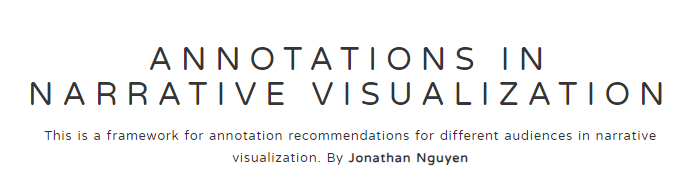
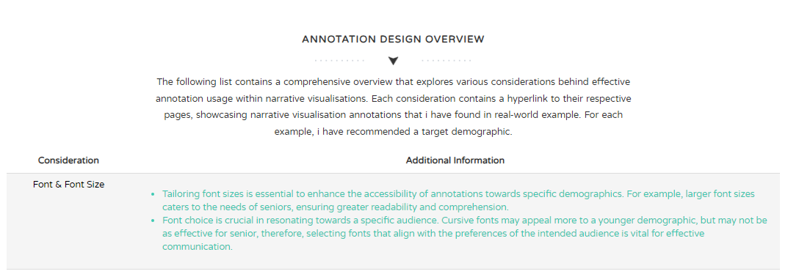
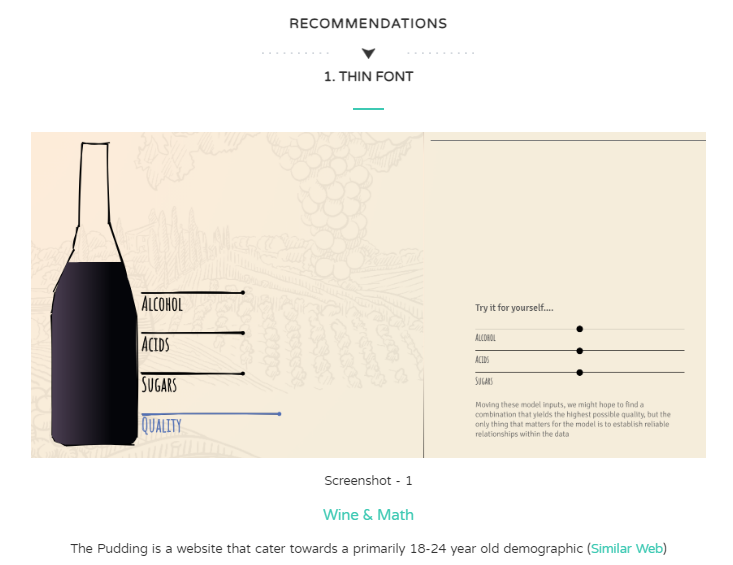

# Annotation Interactive Framework    

Here is a brief description of the framework and what it aims to provide:

## Getting started

A quick introduction of what you need to get the app up and running locally:

Open up visual studio
Install Live Server
Right-Click a html file (preferably index.html) and "Open with Live Server"

## Developing

### Built with 

HTML/CSS
JavaScript
BootStrap

## Run Down

The framework consists of a comprehensive overview of all the annotation considerations within
narrative visualisation. Each consideration is hyperlinked to its own page, providing additional
details as well as an example implementation.

Furthermore, each page consists of real-world examples of each annotation, outlining its 
current usage.

